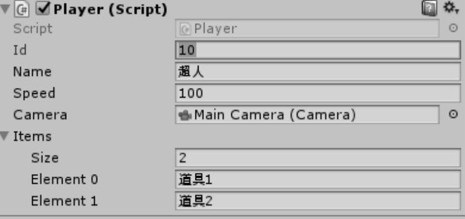

www.iBombr.com
=====

一个游戏策划，学习Unity引擎的过程笔记。  
博客: https://www.inpole.com/

## 当前进度
成功写完第一个`Hello World`脚本。

### 计划
- 读完第一本教程书《Unity 3D手机游戏开发》
- 做完第一款极轻度小游戏
- 做完第一款中轻度休闲游戏
- 继续努力

### 引导
* [iWanr DOCs](https://doc.iwanr.com)

### Screenshots

### License
- [MIT](http://opensource.org/licenses/MIT)

